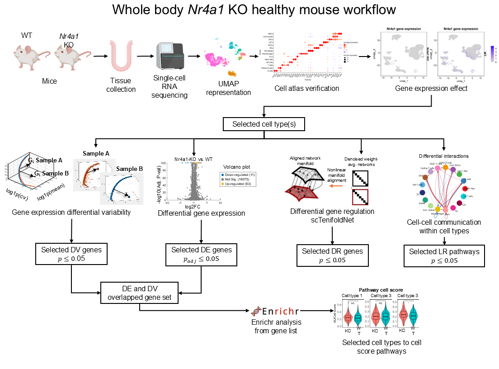

# Single-cell transcriptomic GRN analysis uncovers alteration of colonic mucosal immune cells in Nr4a1 KO mice

This repository contains the analysis code associated with the publication:

**"Single-cell transcriptomic gene regulatory network analysis uncovers the alteration of colonic mucosal immune cells in Nr4a1 knockout mice"**
*iScience (Cell Press) — manuscript ISCIENCE-D-25-13626R2*

Chapkin Lab · Texas A&M University

---

## Pipeline Overview



---

## Data availability

Raw sequencing data (h5 files) and processed count matrices are deposited at the Gene Expression Omnibus (GEO): **[GSE306798]** *(accession to be updated upon acceptance).*

The final annotated Seurat RDS object is available from the corresponding author upon reasonable request. It is not required for full reproducibility — see the **Reproducing the analysis** section below.

---

## Reproducing the analysis from scratch

The full analysis can be reproduced starting from the GEO h5 files using the following workflow:

```
1. Download raw h5 files from GEO [GSE######]
2. matlab_annotation/s1_processh5files.m   — process h5 files into MAT format
3. matlab_annotation/s2_mergematfiles.m    — merge MAT files into a single matrix
4. Import metadata_subann4.xlsx            — adds cell-level annotations AND CellPotency scores
5. seurat_R_processing/ scripts 01 → 08   — run the full R analysis pipeline in order
```

`metadata_subann4.xlsx` (included in this repository) contains all cell-level annotations, subannotation labels, and CCAT/SCENT differentiation potency scores (`CellPotency` column) synchronized with the GEO-deposited data. Importing this file after the MATLAB processing step is sufficient to fully reconstruct the annotated object — **re-running the MATLAB SCENT toolbox is not required.**

> **Note on CCAT/SCENT potency scoring:** Differentiation potency scores were originally computed using the MATLAB SCENT toolbox ([Teschendorff et al.; github.com/aet21/SCENT](https://github.com/aet21/SCENT)) applied interactively via the MATLAB GUI. The raw SCENT output is archived as `cell_potency.xlsx` (repository root) for reference. These scores are also embedded in `metadata_subann4.xlsx` as the `CellPotency` column, so no MATLAB re-run is needed to reproduce the downstream R analysis.

---

## Repository structure

```
.
├── matlab_annotation/                       # MATLAB scripts: h5 processing and cell annotation
├── seurat_R_processing/                     # Core R analysis pipeline — run scripts in order 01 → 08
├── extra_analysis/                          # Supporting and validation analyses
├── exon_analysis_nr4a1.ipynb               # Python notebook: Nr4a1 exon detection across cell types
├── metadata_subann4.xlsx                    # Cell annotations + CellPotency — import after GEO download
├── cellscores.xlsx                          # Gene sets for colonocyte AUCell scoring (script 07)
├── cell_potency.xlsx                        # Raw CCAT/SCENT output from MATLAB (archived reference)
├── cell_potency_score_colonocytes_stats.xlsx # Summary statistics for colonocyte potency scores (output)
├── 2023_nr4a1_colon_meta_info.xlsx          # Sample-level metadata
├── Nr4a1_Exon_Detailed_Analysis.xlsx        # Exon-level detection output
├── Nr4a1_Exon_Summary_Table.csv             # Exon summary table
├── Nr4a1_ko_workflow2.svg                   # Analysis pipeline overview figure
└── copy_sc_data.sh                          # Shell script for staging raw data files
```

---

## matlab_annotation/

MATLAB scripts for initial processing of raw 10x h5 files. Run before the R pipeline.

| File | Description |
|------|-------------|
| `s1_processh5files.m` | Loads and processes raw 10x Genomics h5 files; outputs MAT files per sample |
| `s2_mergematfiles.m` | Merges per-sample MAT files into a single data matrix for import into R |
| `nr4a1_wholebody_ko_markers.txt` | Cell type marker genes used for cluster annotation |

---

## seurat_R_processing/

Core numbered R analysis pipeline. Scripts are intended to be run in order (01 → 08). Each script saves output objects used by subsequent scripts.

| Script | Description |
|--------|-------------|
| `01_nr4a1_whole_body_KO_analysis_extraction.R` | QC, filtering, normalization, dimensionality reduction, clustering; imports cell annotations and CellPotency scores from `metadata_subann4.xlsx` and exon data from `Nr4a1_Exon_Detailed_Analysis.xlsx` |
| `02_nr4a1_whole_body_KO_differential_expression.R` | Differential expression (DE) analysis between KO and WT for each annotated cell type |
| `03_nr4a1_whole_body_KO_differential_variability.R` | Differential variability (DV) analysis using scran; identifies genes with altered transcriptional noise in KO |
| `03_5_nr4a1_whole_body_KO_dv_de_enrichr.R` | GO enrichment analysis on DV+DE overlapping gene sets using Enrichr; generates Supplementary Table ST 3 |
| `04_nr4a1_whole_body_KO_cellchat.R` | Cell-cell communication analysis using CellChat 2.0; identifies altered ligand-receptor signaling in KO |
| `05_nr4a1_whole_body_KO_sctenifold_net_results.R` | Gene regulatory network (GRN) inference and differential regulation (DR) analysis using scTenifoldNet |
| `06_nr4a1_whole_body_KO_Tcells_analysis_and_plots.R` | T cell sub-clustering, AUCell scoring, analysis and visualization; reads `Genesets_cell_scores.xlsx` |
| `07_nr4a1_whole_body_KO_colonocytes_analysis_and_plots.R` | Colonocyte sub-clustering, AUCell scoring, cell cycle scoring (Seurat CellCycleScoring), and potency score visualization; reads `cellscores.xlsx` (repository root) |
| `08_nr4a1_whole_body_KO_immune_cells_proportions.R` | Quantification and visualization of immune cell type proportions across KO and WT |
| `Genesets_cell_scores.xlsx` | Gene sets for AUCell scoring in T cell populations (script 06) |

---

## extra_analysis/

Supporting analyses and validation scripts not part of the main numbered pipeline.

| File | Description |
|------|-------------|
| `nr4a1_whole_body_KO_analysis.R` | Original master analysis script; precursor to the numbered pipeline; retained for reference |
| `tcells_subannotation.R` | T cell subannotation; assigns T cell subtypes used as input to script 06 |
| `plot_colonic_organoids.R` | Plots colonic organoid-forming efficiency data comparing KO and WT |
| `plot_qpcr_nr4a1_2.R` | Plots qPCR validation data for Nr4a1 expression |
| `nr4a1_qpcr.csv` | Raw qPCR data for Nr4a1 expression validation |

---

## Dependencies

**R packages:** Seurat (v4+), scran, CellChat (v2), scTenifoldNet, AUCell, enrichR, ggplot2, dplyr, readxl, openxlsx, writexl

**Python:** Jupyter, scanpy (for `exon_analysis_nr4a1.ipynb`)

**MATLAB:** SCENT toolbox ([github.com/aet21/SCENT](https://github.com/aet21/SCENT)) — only needed if re-running potency scoring; scores are already provided in `metadata_subann4.xlsx`

---

## Citation

If you use this code, please cite:

> Romero et al. *Single-cell transcriptomic gene regulatory network analysis uncovers the alteration of colonic mucosal immune cells in Nr4a1 knockout mice.* iScience (2025). *(DOI to be updated upon acceptance)*

---

## Contact

Selim S. Romero — ssromerogon@tamu.edu
Chapkin Lab — [chapkinlab.tamu.edu](https://chapkinlab.tamu.edu)
